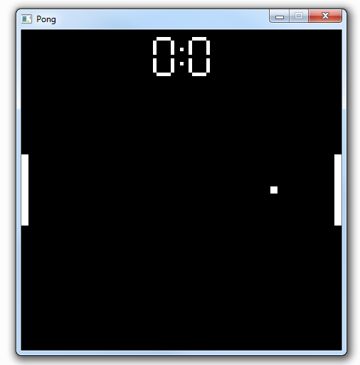

# Pong 

A simple Pong game written in C++ with opengl.

- Using GLFW3 for window context
- Faked Collision

# Todo

- Replace Immidiate mode ( Change Code to OpenGL 3.0 )
- Add a proper 2D collision system (AABB)
- Add Sounds
